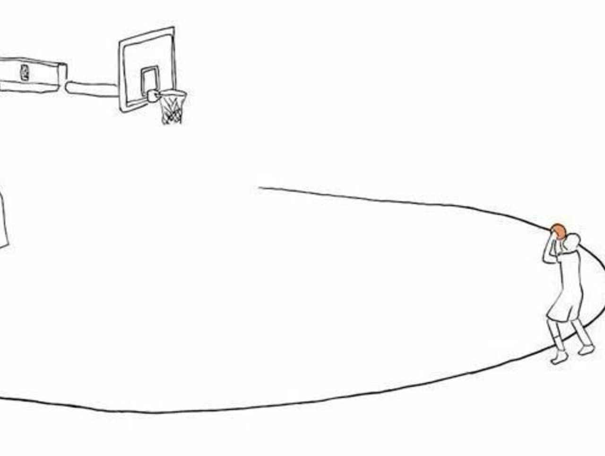
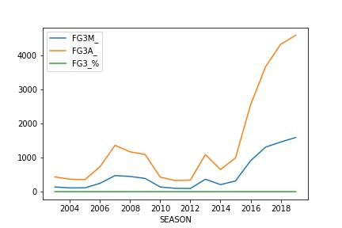

<div id="top"></div>
<!--
*** Thanks for checking out the Best-README-Template. If you have a suggestion
*** that would make this better, please fork the repo and create a pull request
*** or simply open an issue with the tag "enhancement".
*** Don't forget to give the project a star!
*** Thanks again! Now go create something AMAZING! :D
-->


<!-- PROJECT SHIELDS -->
<!--
*** I'm using markdown "reference style" links for readability.
*** Reference links are enclosed in brackets [ ] instead of parentheses ( ).
*** See the bottom of this document for the declaration of the reference variables
*** for contributors-url, forks-url, etc. This is an optional, concise syntax you may use.
*** https://www.markdownguide.org/basic-syntax/#reference-style-links
-->
[![Contributors][contributors-shield]][contributors-url]
[![Forks][forks-shield]][forks-url]
[![Stargazers][stars-shield]][stars-url]
[![Issues][issues-shield]][issues-url]
[![LinkedIn][linkedin-shield]][linkedin-url]


<!-- PROJECT LOGO -->
<br />
<div align="center">
  <a href="https://github.com/camiloms10/NBA_project">
    
  </a>

<h3 align="center">NBA Analysis</h3>

  <p align="center">
    This project was made using Python, specifically Pandas, to analyze NBA statistics through the 2003 till 2019 season, and how the 2012 season changed the way basketball is played (focusing more in the 3 point shot).
    <br />
    <a href="https://github.com/camiloms10/NBA_project"><strong>Explore the docs »</strong></a>
    <br />
    <br />
    <a href="https://github.com/camiloms10/NBA_project/issues">Report Bug</a>
    ·
    <a href="https://github.com/camiloms10/NBA_project/issues">Request Feature</a>
  </p>
</div>


<!-- TABLE OF CONTENTS -->
<details>
  <summary>Table of Contents</summary>
  <ol>
    <li>
      <a href="#about-the-project">About The Project</a>
      <ul>
        <li><a href="#built-with">Built With</a></li>
      </ul>
    </li>
    <li>
      <a href="#getting-started">Getting Started</a>
      <ul>
        <li><a href="#prerequisites">Prerequisites</a></li>
        <li><a href="#data-sources">Data Sources</a></li>
      </ul>
    </li>
    <li><a href="#usage">Usage</a></li>
    <li><a href="#roadmap">Roadmap</a></li>
    <!--<li><a href="#contributing">Contributing</a></li>-->
    <!--<li><a href="#license">License</a></li>-->
    <li><a href="#contact">Contact</a></li>
    <!--<li><a href="#acknowledgments">Acknowledgments</a></li>-->
  </ol>
</details>


<!-- ABOUT THE PROJECT -->
## About The Project



Through this project you´ll find multiple analysis about how the NBA´s way of playing the game evolved from a 2 pointer attempting game to a longer range (3 pointer) style of play, this will be shown by correlation coefficients, line charts and pareto charts (main drivers of change).

<p align="right">(<a href="#top">back to top</a>)</p>


### Built With

* [Python](https://www.python.org)

<p align="right">(<a href="#top">back to top</a>)</p>


<!-- GETTING STARTED -->
## Getting Started


### Prerequisites

These are the python libraries you´ll need to run the ipynb file.
* Libraries
  ```sh
  pip install numpy
  pip install seaborn 
  pip install matplotlib
  pip install pandas
  pip install sklearn 
   ```

<p align="right">(<a href="#top">back to top</a>)</p>

### Data Sources

The data source of this project where downloaded from [Kaggle](https://www.kaggle.com/nathanlauga/nba-games)
* These are the csv files used inside the project

  * **games.csv :** all games from 2004 season to last update with the date, teams and some details like number of points, etc.
  * **games_details.csv :** details of games dataset, all statistics of players for a given game
  * **players.csv :** players details (name)
  * **ranking.csv :** ranking of NBA given a day (split into west and east on CONFERENCE column
  * **teams.csv :** all teams of NBA

<p align="right">(<a href="#top">back to top</a>)</p>


<!-- USAGE EXAMPLES -->
## Usage

You can use this data to analyze:
* How a player has performed through time
* The correlation between individual NBA metrics and general team results (wins)
* Predict a game result based on the team´s individuals
* Etc.
<p align="right">(<a href="#top">back to top</a>)</p>


<!-- ROADMAP -->
## Roadmap

To do ALL of the following analysis first I did the import via pd.read_csv commands and joined them as I needed to, you can check that inside the .ipynb file.

### 1. Center position game style change through the years

<p align ="center">

</p>

After 2012 Centers started to take more 3 pointer shots

### 1. Center position game style change through the years

### 1. Center position game style change through the years

See the [open issues](https://github.com/camiloms10/NBA_project/issues) for a full list of proposed features (and known issues).

<p align="right">(<a href="#top">back to top</a>)</p>


<!-- CONTRIBUTING 
## Contributing

Contributions are what make the open source community such an amazing place to learn, inspire, and create. Any contributions you make are **greatly appreciated**.

If you have a suggestion that would make this better, please fork the repo and create a pull request. You can also simply open an issue with the tag "enhancement".
Don't forget to give the project a star! Thanks again!

1. Fork the Project
2. Create your Feature Branch (`git checkout -b feature/AmazingFeature`)
3. Commit your Changes (`git commit -m 'Add some AmazingFeature'`)
4. Push to the Branch (`git push origin feature/AmazingFeature`)
5. Open a Pull Request

<p align="right">(<a href="#top">back to top</a>)</p>
-->


<!-- LICENSE 
## License

Distributed under the MIT License. See `LICENSE.txt` for more information.

<p align="right">(<a href="#top">back to top</a>)</p>
-->


<!-- CONTACT -->
## Contact

Camilo Manzur - [@LinkedIn](https://www.linkedin.com/in/camilo-manzur-4b7137a8/)

Project Link: [https://github.com/camiloms10/NBA_project](https://github.com/camiloms10/NBA_project)

<p align="right">(<a href="#top">back to top</a>)</p>


<!-- ACKNOWLEDGMENTS 
## Acknowledgments

* []()
* []()
* []()

<p align="right">(<a href="#top">back to top</a>)</p>
-->


<!-- MARKDOWN LINKS & IMAGES -->
<!-- https://www.markdownguide.org/basic-syntax/#reference-style-links -->
[contributors-shield]: https://img.shields.io/github/contributors/camiloms10/NBA_project.svg?style=for-the-badge
[contributors-url]: https://github.com/camiloms10/NBA_project/graphs/contributors
[forks-shield]: https://img.shields.io/github/forks/camiloms10/NBA_project.svg?style=for-the-badge
[forks-url]: https://github.com/camiloms10/NBA_project/network/members
[stars-shield]: https://img.shields.io/github/stars/camiloms10/NBA_project.svg?style=for-the-badge
[stars-url]: https://github.com/camiloms10/NBA_project/stargazers
[issues-shield]: https://img.shields.io/github/issues/camiloms10/NBA_project.svg?style=for-the-badge
[issues-url]: https://github.com/camiloms10/NBA_project/issues
[linkedin-shield]: https://img.shields.io/badge/-LinkedIn-black.svg?style=for-the-badge&logo=linkedin&colorB=555
[linkedin-url]: https://www.linkedin.com/in/camilo-manzur-4b7137a8/
[product-screenshot]: images/screenshot.png